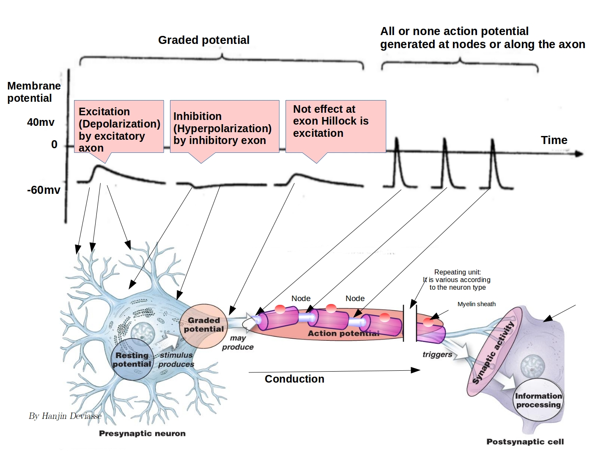
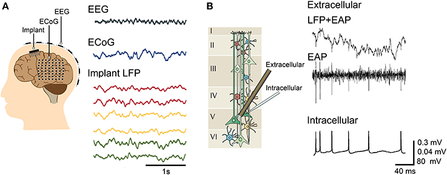
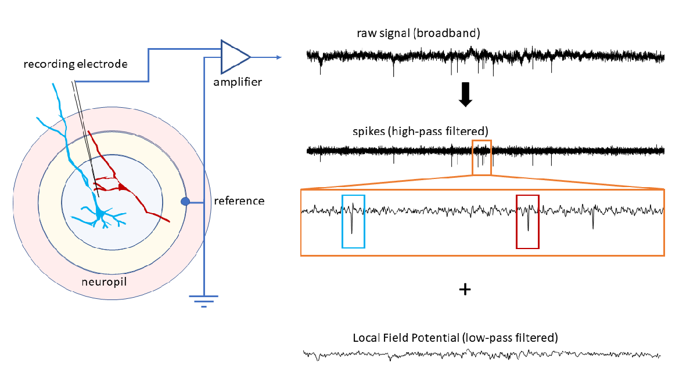
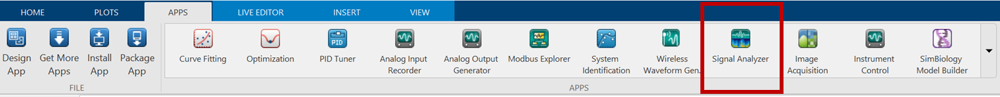
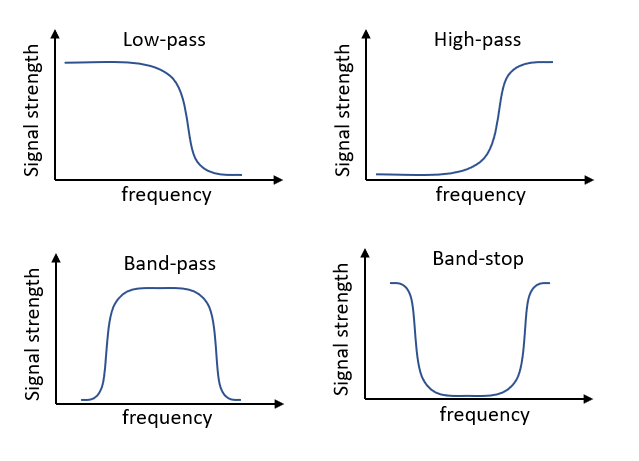
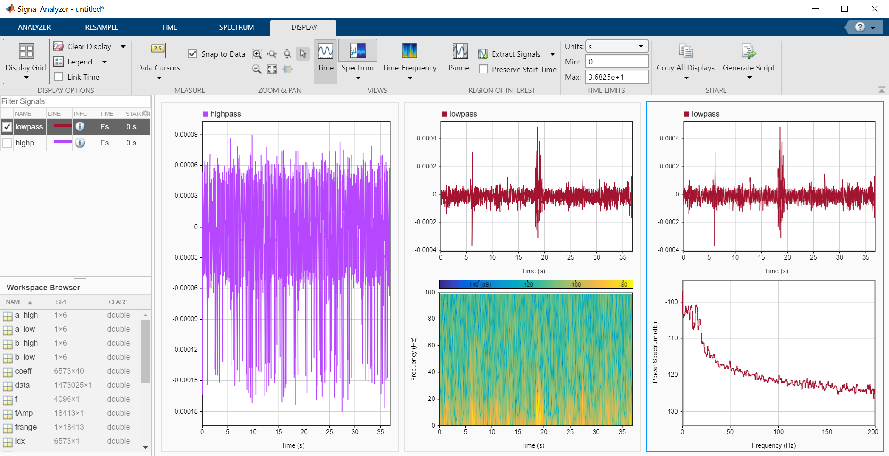

# 神経活動解析のためのMATLABチュートリアル

MATLAB tutorial for the analysis of neural signals

# 1. このチュートリアルについて
## 1.1 目的

このチュートリアルは、MATLABで神経活動に関する基礎的な信号処理・解析を神経科学者が行えるように設計されています。神経科学者にとって、**電気生理学**(Electrophysiology)、つまり神経細胞からの放電を調べるにあたって、神経信号の処理は重要なステップになります。このチュートリアルを終えると、以下のことができるようになってるでしょう。

   -  電気生理学データに対する基本的処理のワークフローをMATLABで作ることができる 
   -   [信号アナライザーアプリ (Signal Analyzer ](https://www.mathworks.com/help/signal/ref/signalanalyzer-app.html)power spectrum calculations) を利用できる 
   -  [フィルターを設計](https://jp.mathworks.com/discovery/filter-design.html)できる 
   -  [パワースペクトル](https://jp.mathworks.com/help/signal/ref/pspectrum.html)の計算(power spectrum calculations)や[時間周波数解析](https://jp.mathworks.com/help/signal/time-frequency-analysis.html?category=time-frequency-analysis&s_tid=CRUX_topnav)などの[周波数領域解析](https://jp.mathworks.com/help/matlab/math/basic-spectral-analysis.html)ができる 
   -  （ラボミーティングや学会などの）発表で使える[ライブスクリプト](https://jp.mathworks.com/help/matlab/matlab_prog/what-is-a-live-script-or-function.html)に、解析と結果を統合できる 

このチュートリアルを行うには、[Signal Processing Toolbox](https://www.mathworks.com/products/signal.html)と[Statistics and Machine Learning Toolbox](https://www.mathworks.com/products/statistics.html)が必要です。もしMATLABのライセンスがない場合、評価版は[ここからダウンロード](https://jp.mathworks.com/campaigns/products/trials.html)できます。

## 1.2 さらに学びたい人のために

神経科学分野におけるMATLAB利用に関するリソースはこちらです

   -  神経科学向けMATLAB: The MathWorks [Neuroscience](https://www.mathworks.com/solutions/neuroscience.html) page including the section on [tools](https://www.mathworks.com/solutions/neuroscience/resources.html).  
   -  信号処理入門: For signal processing fundamentals, the self-paced [Signal Processing OnRamp](https://www.mathworks.com/learn/tutorials/signal-processing-onramp.html) from MathWorks.  
   -  神経科学に関する MATLAB の最新機能: Latest features in MATLAB suited for[ neural and biosignal analysis](https://www.mathworks.com/solutions/neuroscience/latest-features.html) 
   -   さらに学びたい人のための本: More material and related exercises in the books [MATLAB for Neuroscientists](https://www.amazon.com/MATLAB-Neuroscientists-Introduction-Scientific-Computing/dp/0123838363/ref=sr_1_1?crid=129ZX09LJQSYP&dchild=1&keywords=matlab+for+neuroscientists&qid=1608231902&sprefix=MATLAB+for+ne%2Caps%2C255&sr=8-1) and [Signal Processing for Neuroscientists](https://www.amazon.com/Signal-Processing-Neuroscientists-Introduction-Physiological-ebook/dp/B00AQ47LCK/ref=sr_1_2?crid=XGLZ4C9MXZSU&dchild=1&keywords=signal+processing+for+neuroscientists&qid=1608231868&sprefix=signal+proceesing+for+neuroscien%2Caps%2C326&sr=8-2) 

## 1.3 扱われている題材

このチュートリアルでは、実験分野の電気生理学で広く用いられる標準的な手法を実装しています。以下のものを含んでいます

   -  神経活動データの読み込み 
   -  信号の可視化 
   -  高周波（スパイク）と低周波（局所フィールド電位 (local field potential), LFP)帯域への信号フィルタリング 
   -  高周波信号からのスパイク取り出し 
   -  主成分分析(Principal component analysis)や混合ガウスモデルクラスタリング(Gaussian mixed model clustering)を利用したスパイク波形ソーティング 
   -  低周波帯域のパワースペクトルの計算 
   -  低周波帯域のピリオドグラム（時間周波数プロット）の計算 

使われている関数: [*timetable*](https://www.mathworks.com/help/matlab/ref/timetable.html?searchHighlight=timetable&s_tid=srchtitle)*, *[*butter*](https://www.mathworks.com/help/signal/ref/butter.html?searchHighlight=butter&s_tid=srchtitle)*, *[*filtfilt*](https://www.mathworks.com/help/signal/ref/filtfilt.html?searchHighlight=filtfilt&s_tid=srchtitle)*, *[*findpeaks*](https://www.mathworks.com/help/signal/ref/findpeaks.html?searchHighlight=findpeaks&s_tid=srchtitle)*, *[*pca*](https://www.mathworks.com/help/stats/pca.html?searchHighlight=pca&s_tid=srchtitle)*, *[*fitgmdist*](https://www.mathworks.com/help/stats/fitgmdist.html)*, *[*cluster*](https://www.mathworks.com/help/stats/gmdistribution.cluster.html?searchHighlight=cluster&s_tid=srchtitle)*, *[*histogram*](https://www.mathworks.com/help/matlab/ref/matlab.graphics.chart.primitive.histogram.html?searchHighlight=histogram&s_tid=srchtitle)*, *[*fft*](https://www.mathworks.com/help/matlab/ref/fft.html?searchHighlight=fft&s_tid=srchtitle)*, *[*pspectrum*](https://www.mathworks.com/help/signal/ref/pspectrum.html?searchHighlight=pspectrum&s_tid=srchtitle)*, *[*spectrogram*](https://www.mathworks.com/help/signal/ref/spectrogram.html?searchHighlight=spectrogram&s_tid=srchtitle)

# 2. 背景と重要なポイント

樹状突起、細胞体、軸索からなるニューロンによって神経系は構成されています。細胞外液よりも負になる**静止膜電位**(*resting membrane potential*)をニューロンは持っています。周囲のニューロンからの興奮性の刺激は、樹状突起において、瞬間的な正方向への電位の揺らぎ（**脱分極**、*depolarizations****)****を生み出します。脱分極した電位の合計が閾値を超えると、神経細胞膜にある特定のイオンチャネルが開いて正の電荷を持つイオンが細胞膜内に流入して負の膜電位が逆転し、正の****活動電位****(action potential)が発生します。活動電位は*スパイク*(spikes)とも呼ばれます。有名な*Izhikevichモデル\hyperref{09248FF0}{[1]}によるニューロンのスパイク発生機構シミュレーションのMATLABチュートリアルは [こちら](https://jp.mathworks.com/matlabcentral/fileexchange/86198-live_script_spiking_neurons?s_tid=srchtitle)です。

神経科学者が通常記録する神経活動には様々な種類があります。侵襲性と信号の特異性の順に並べていくと、脳波(EEG), 脳皮質電位(ECoG)、局所フィールド電位(LFP)、細胞外記録、細胞内記録があります。最も信号の特異性が高いのは細胞内記録であり、単一の細胞からの信号を記録するものです。しかし、特異性が増すに従って、実験者が信号を取る神経組織がだんだんと空間的に小さくなっていきます。これら*すべての信号は神経活動信号であり、このチュートリアルで示されるステップを使って解析できます。*



*細胞体で活動電位を引き起こす軸索における脱分極を示した図。Image courtesy: *\hyperref{B6C478DC}{[2]  }

  



*神経科学者によってよく扱われる電気生理学の信号の図。 Image courtesy: *\hyperref{DE3C9ACE}{[3]}. *Includes content originally from Buzsaki lab [4], [5]. *

  
## 2.1 神経科学者による電気生理学データ解析の標準的な手順

脳や神経細胞に電極を置くことによって、基準電極と比較した近傍ニューロンからの放電を活動電位として記録できます。基準電極の場所は、信号を小さな領域からとるか(基準電極が記録電極のそばにある; スパイクの記録に適している）、大きな領域からとるか（基準電極が記録電極と離れている; LFPの記録に適している）に依存して決まります。さらに、スパイクは高周波に属している一方（時間幅がおよそ600 µs)、LFPは低周波の信号であり、遅い時間成分で（スパイクが発生する）閾値よりも低い電位のゆらぎをとらえるものです。



*基本的な電気生理データ取得の構成を図解したもの。複数ニューロン間のニューロピル(neuropil)に記録用電極は挿入される。基準電極もニューロピルのどこかに置かれる。基準電極が記録電極に近いほど、信号が記録される電場は小さくなる。生の波形は増幅され、適切なサンプリング周波数でディジタル化される。生波形のフィルタリングは２つの成分を生み出す。ハイパス処理された成分(500Hz以上）はスパイクを取り出すのに向いている。複数の異なるニューロンからのスパイク（色付きのボックスで示される）は同一の（記録用）電極で記録される可能性があり、後で分離される必要がある（スパイク波形取り出しとソーティング）。スパイクの解析は、ふつう時間領域に限定される。ローパス処理された成分は、閾値以下の入力や広い領域のゆらぎに関する情報を持つLFPの分析に向いている。LFPの解析は、ふつう周波数領域において行われる。画像：Shubo Chakrabarti.*

  
# 2.2 ナイキストの法則とサンプリング周波数

サンプリング周波数（アナログ信号をデジタル化する周波数）は、解析したい信号に現れる最大周波数の少なくとも2倍よりも大きい値でなければなりません。もしデータが250Hzまでの周波数を含む場合、サンプリング周波数は500Hz (1秒あたり500点でデジタル化されている）よりも大きく取る必要があります。これはナイキストの法則(Nyquist Law)と呼ばれます。活動電位(スパイク、spike)は合計1ms以内の高い周波数で起こる現象であるため、神経活動は10kHzよりも高いサンプル周波数で記録されます。電気生理用のA/Dボードはサンプリング周波数を調整可能です。

以上のことをMATLABで経験してみるために、2Hzと10Hzの周波数の2つのサイン波を作成してみます。この2つの信号を、どちらも5Hzのサンプル周波数で記録します。サイン波は以下のように書けます


```matlab:Code
fsExample = 20; % sampling frequency
x = 0:1/fsExample:1-1/fsExample; % time axis (sampling)
sine1 = sin(2*pi*2*x); % sine wave of 2 Hz
sine2 = sin(2*pi*10*x); % sine wave of 10 Hz
```

基準のために高サンプルレートの信号を作成します

```matlab:Code
CompareAgainstTrueSignals = true;
if CompareAgainstTrueSignals
    fs_control = 1000;
    x_control = 0:1/fs_control:1-1/fs_control;
    sine1_control = sin(2*pi*2*x_control); % sine wave of 2 Hz
    sine2_control = sin(2*pi*10*x_control);
end

```

信号をプロットします

```matlab:Code
figure; hold on
plot(x,sine1,'r','LineWidth',1);
plot(x,sine2,'b','LineWidth',1);
if CompareAgainstTrueSignals
    plot(x_control,sine1_control,':r','LineWidth',1);
    plot(x_control,sine2_control,':b','LineWidth',1);
end
xlabel('time');
legend('2Hz','10Hz')
```

# 3. データの前処理と解析の手順
## 3.1 データの読み込み

異なる種類のデータも、MATLABで直接読み込むことができます。データタイプ（研究とそのほか広く使われるデータの形式）のリストは[ここ](https://jp.mathworks.com/help/matlab/import_export/supported-file-formats.html)にあります。

神経科学者向けに、[BIDS](https://github.com/bids-standard/bids-matlab), [NeurodatawithoutBorders](https://github.com/NeurodataWithoutBorders/matnwb), [NIfTI](https://www.mathworks.com/help/images/ref/niftiread.html), [EDF](https://www.mathworks.com/help/signal/ref/edfread.html)などの特殊フォーマットのいくつかはMATLABでサポートされています。[多くのベンダー](https://jp.mathworks.com/products/connections/search-products.html?q=&fq=marketing-industry:neuroscience&page=1)がMATLABでデータにアクセスするための関数を提供しています。

この演習課題では、ガラス絶縁タングステン電極を用いてげっ歯類体性感覚野\hyperref{DC88C291}{[6]} から記録されたデータセットを用います。データセットは*neural_data.matに保存され、data* (ベクトル) and *fs* (スカラー)という２つの変数を持ちます。fsは40kHzのサンプリング周波数を示します。データは各点でアナログ-ディジタル変換器によってディジタル化された電位信号を含んでいます。fsはサンプリング周波数です。これは、１秒当たり何回電極からのアナログ信号がディジタル化されたかを示します。

MATLABにデータを読み込みます

```matlab:Code
clearvars
load('neural_data.mat')
```

## 3.2 データのタイムテーブル形式への変換

次に、信号を [timetable](https://www.mathworks.com/help/matlab/timetables.html?s_tid=CRUX_lftnav)型に変換します。timetableはある一定の間隔でサンプルされている値を扱うのに適しています。時間とデータが一つの変数の中に格納されます。

```matlab:Code
neural = timetable(data,'SampleRate',fs);
neural.Properties.VariableNames{1} = 'raw';
neural.Properties.VariableUnits{1} = 'Volts';
```

## 3.3 信号の可視化

まず信号をプロットし、目で見て調べてみましょう。データを視覚的に確認することで、たくさんのことが分かります。データ解析ワークフローにおいて、探索的な解析を行う最初のステップは、もし後述のステップが自動化されていたとしても、記録された信号を視覚的に確認するところから始まるべきです。このプロセスで

   -  低周波・高周波の信号が含まれているか 
   -  アーチファクトはあるか 

などの基本的な疑問に答えることができます。

まずは時間軸に対して信号をプロットしましょう。タイムスタンプのベクトルを作るため、サンプリング周波数を用います。

```matlab:Code
figure;
plot(neural.Time,neural.raw,'k')
ylabel(neural.Properties.VariableUnits(strcmpi(neural.Properties.VariableNames,'raw'))) % query variable name and units
```

ここからいくつかのことがわかります。

   1.  高周波振動が時折現れる 
   1.  全体的に低周波振動が存在している  
   1.  6秒目あたりで明らかにアーチファクトが見られる 

MATLABのアプリタブ（信号処理と通信）にある[信号アナライザーアプリ](https://jp.mathworks.com/help/signal/ref/signalanalyzer-app.html)を使えば、マウス操作で信号を可視化・解析することもできます。



信号アナライザーアプリを使うと、データの可視化、前処理、分析、比較がインタラクティブに実行できます。

## 3.4 神経活動をスパイクとフィールド電位に分離する

電極によって記録された信号は、低周波成分と高周波成分を持ちます。この２つの成分を分離するために、フィルタを使って周波数ごとに信号を分ける必要があります。MATLABにはいくつかの[フィルタリング機能](https://jp.mathworks.com/discovery/filter-design.html)があります。ここでは、簡単なバターワースフィルタ (Butterworth filter)を使う事にします。バターワースフィルタ (Butterworth filter)は信号の位相シフトを伴うIIRフィルタであり、このために信号が因果関係（訳者注:位相シフトによる時間遅延の意）を持ってしまいます。これを避けるために、両方向（順方向・逆方向）にフィルタをかけて位相シフトの影響を打ち消すゼロ位相フィルタリングを行う[filtfilt](https://www.mathworks.com/help/signal/ref/filtfilt.html)関数を使います。

  



*ハイパス、ローパス、バンドパスフィルタの効果についての図解。x軸は周波数を示し、y軸はパワーを示す。画像はPhilip Lasersteinより提供。*

  

*実験者はフィルタリングのカットオフ周波数を定める必要があります。カットオフ周波数は信号や記録時の条件(50/60Hz帯域の電気ノイズなど）によるので、正しい答えはありません。*

ハイパスフィルタのカットオフ周波数は500Hz, ローパスフィルタのカットオフ周波数は200Hzとして、生波形をフィルタリングして２つに分けてみます

```matlab:Code
HighCutOff = 500;
LowCutOff = 200;
[b_high, a_high] = butter(5,HighCutOff/fs,"high"); % filter co-efficients
[b_low, a_low] = butter(5,LowCutOff/fs,"low");
neural.spikes = filtfilt(b_high,a_high,neural.raw); % filter the signals using zero phase filtering
neural.LFP = filtfilt(b_low,a_low,neural.raw);
neural.Properties.VariableUnits(2:3) = {'Volts','Volts'};
```

スパイクとLFPを比較のためにプロットしてみます

```matlab:Code
figure;
subplot(2,1,1)
plot(neural.Time,neural.spikes,'k')
ylabel(neural.Properties.VariableUnits(strcmpi(neural.Properties.VariableNames,'spikes')))
title(['Spikes: High Frequency Component [>',num2str(HighCutOff),'Hz]'])
subplot(2,1,2)
plot(neural.Time,neural.LFP,'k')
ylabel(neural.Properties.VariableUnits(strcmpi(neural.Properties.VariableNames,'LFP')))
title(['LFPs: Low Frequency Component [<',num2str(LowCutOff),'Hz]'])
```

アーチファクトが低周波域にあったことが分かります（おそらく動きによるものです）

やってみよう: 神経活動のtimetableデータを信号アナライザーアプリで読み込んで、信号を表示しましょう。ROIをデータカーソルで取り出しましょう

## 3.5 スパイクの検出、取り出し、ソーティング
  

データをハイパスフィルタで処理したら、スパイクを取り出す必要があります。スパイクの取り出しには３つのステップがあります。

   1.  閾値を定め、閾値を超えたものの局所最小値を見つけ出す 
   1.  スパイク波形を含むデータの一部を取り出す。これによって、信号に存在するすべてのスパイク波形がわかる(MUA) 
   1.  2.で取り出されたスパイク波形をカテゴリに分別していく。これによって、それぞれの波形がある単一のニューロンからのスパイク波形がわかる(SUA) 

### 3.5.1 スパイク検出

閾値を超えたすべての最小値を取り出してみましょう。このためにはピークの検出を信号の反転値について行い（最小値を求める）、閾値を超えた部分を見つけ出します

```matlab:Code
threshold = -0.000033;
[pks,locs] = findpeaks(-neural.spikes,'MinPeakHeight',abs(threshold));
figure
plot(neural.Time,neural.spikes); hold on
line([min(neural.Time) max(neural.Time)],[threshold threshold],'color','r','LineWidth',1)
scatter(neural.Time(locs),-pks,'or'); hold off
```

### 3.5.2 スパイクの抽出

波形の最小値を中心として、一定時間窓の信号を取り出します

```matlab:Code
prePeak = 0.0005; % length of window to extract before spike peak (s)
posPeak = 0.0005; % length of window to extract after spike peak (s)
prePeakTimes = neural.Time(locs)-seconds(prePeak); % window limits centered on spike minima
posPeakTimes = neural.Time(locs)+seconds(posPeak);
prePeakTimes(prePeakTimes<0) = 0; % trim windows exceeding beyond zero
posPeakTimes(posPeakTimes>max(neural.Time)) = max(neural.Time); % trim windows exceeding beyond signal end

```

時間窓の最初と最後の値をループすることでスパイクを含む信号の一部を取り出していきます

```matlab:Code
ts = -prePeak:1/fs:posPeak;
spks = zeros(length(locs),length(ts));
for i = 1:length(locs)
    S = timerange(prePeakTimes(i),posPeakTimes(i),'closed');
    spks(i,:) = neural.spikes(S);
end
figure;
plot(ts,spks','k')
ylabel(neural.Properties.VariableUnits(strcmpi(neural.Properties.VariableNames,'spikes'))) % query variable name and units
```

### 3.5.3 スパイクソーティング

上の図で分かる通り、データには２つの異なる波形、つまり大きな極小値とそれよりも小さい極小値を持つものがあります。電極はそれぞれのニューロンに対して特有な空間的関係を持っているために、同じニューロンならば似たような波形になりますが、異なるニューロンは異なる波形を持つことになります。[スパイクソーティング](https://www.sciencedirect.com/science/article/pii/S0361923015000684)は、[ ](https://www.sciencedirect.com/science/article/pii/S0361923015000684)記録された波形の類似や違いによって、異なるニューロンからの推定される放電を分離することを目的としています。スパイクソーティングにおいて、いくつか注意があります。

   1.  きれいに分離できるスパイクを取るためには、よい状態の記録用電極（インピーダンス、絶縁）が、効率的な位置に配置されている必要があります。 
   1.  すべてのスパイクソーティングの手法は、スパイクの波形によってスパイクを分離します。スパイクソーティングによって得られたスパイクが一つのニューロンから得られた信号であるというのは、あくまで推定にすぎません。 
   1.  細胞外記録は非定常（non-stationary)です。つまり、スパイクは形を変えたり、電極が組織内で動いたりすることでノイズと重なってしまう可能性もある、ということです。 

たくさんのスパイクソーティングアルゴリズムがあります。自由に利用・ダウンロードできるスパイクソーティングアルゴリズムは、[MATLAB File Exchange](https://www.mathworks.com/matlabcentral/fileexchange?category%5B%5D=1728&q=spike+sorting)で見つけることができます。

### 3.5.4 主成分分析

波形をソーティングするために、最も簡単なクラスタリングアルゴリズムの一つである[主成分分析](https://www.mathworks.com/help/stats/principal-component-analysis-pca.html) (Pricipal component analysis, PCA) を使います。どのようなデータセットも、そのデータの持つ主成分に分けることができます。主成分軸に沿ったデータの分布を見ることで、データの持つ分散の一部を説明することができます。データが持つほとんどの分散は、最初の幾つかの主成分で説明可能でしょう。主成分分析を、楕円体のエンベロープ(ellipsoid envelop)によるデータのフィッティングと考える人もいるかもしれません。楕円体のそれぞれの軸が、主成分を表しています。もし、軸が小さい場合、その成分のばらつきは小さいことになります。最もばらつきが大きくなる主成分についてのデータの分布は、クラスタを認識したり分離するのが簡単でしょう。

例として、波形が1msに40回のサンプル点をもつ40,000Hzで記録されたスパイクデータを用います。つまり、それぞれのスパイクは、40点(次元）で異なっている可能性があるということです。主成分分析によって、データが最も大きいばらつきを示す[２つの成分に絞ります](https://www.mathworks.com/help/stats/dimensionality-reduction.html)。

```matlab:Code
coeff = pca(spks');
figure; 
scatter(coeff(:,1),coeff(:,2),'.k')
xlabel('PC1')
ylabel('PC2')
```

### 3.5.5 混合ガウス モデルを使用したクラスタリング

40次元のデータを、最も大きなばらつきをもつ2次元のデータに落とすことができました。このプロットで2つのクラスタがはっきりと見えます。次のステップでは、これらのクラスタを定義して、すべてのデータ点をどちらかのクラスタに分けていきます。

いくつかの自動[クラスタリングアルゴリズム](https://www.mathworks.com/discovery/cluster-analysis.html)がありますが、[混合ガウス モデルを使用したクラスタリング](https://www.mathworks.com/help/stats/clustering-using-gaussian-mixture-models.html) (gaussian mixture model based clustering）もその一つです。２つの成分を持つガウスモデルを作ります。

```matlab:Code
GMM = fitgmdist(coeff(:,1:3),2,'Start','plus','CovarianceType',"diagonal",'SharedCovariance',true); % fit 2 Gaussian models to the data
idx = cluster(GMM,coeff(:,1:3)); % cluster using the GMM
```

次のコードは重要なものではありません。図をきれいに見せるため、大きなスパイクをノイズの上にプロットするようにしています。

```matlab:Code
if max(coeff(idx==1,1))>max(coeff(idx==2,1))
    idx2 = idx;
    idx(idx2==2) = 1;
    idx(idx2==1) = 2;
    clear idx2
end
```

もともとのPCAクラスタをプロットし、その上にクラスタのラベルを表示します

```matlab:Code
figure; % re-plot original PCA 
xlabel('PC1'); ylabel('PC2'); axis square; hold on
```

クラスタと生のPCAデータを入れ替えます（重要ではありません）

```matlab:Code
superimposeClusterLabels = true; 
if ~superimposeClusterLabels
    scatter(coeff(:,1),coeff(:,2),'.k')
else
    scatter(coeff(idx==1,1),coeff(idx==1,2),'.b')
    scatter(coeff(idx==2,1),coeff(idx==2,2),'.r')
end
```

もともとのスパイク波形を、色のついたクラスタラベルでプロットしなおしたい場合、用いたソーティング法の結果で、可視化することができます

```matlab:Code
figure;  axis square; hold on % plot the original waveforms
ylabel(neural.Properties.VariableUnits(strcmpi(neural.Properties.VariableNames,'spikes'))) % query variable name and units
```

クラスタリングした波形と生波形を入れ替えます（重要ではありません）

```matlab:Code
colorCodeWaveformClusters = true; 
if ~colorCodeWaveformClusters
    plot(ts,spks','k');
else
    plot(ts,spks(idx==1,:)','b'); 
    plot(ts,spks(idx==2,:)','r'); 
end
```

### 3.5.6 ラスタープロットとPSTGのためにクラスタラベルを用いる

ラスタープロットを描き（訳者注: scatterを用いて赤～オレンジの点で示されています）、スパイクを時間間隔に並べてPETH (peri-event time histogram, 訳者注: 日本語でもPETHと訳されることが多い）を出すために、クラスタのインデックスを取得します。

```matlab:Code
figure; hold on
plot(neural.Time,neural.spikes,'k')
scatter(neural.Time(locs(idx==2)),repmat(-1.5e-4,sum(idx==2),1),'.r')
```

特定のイベントに合わせてスパイクの回数をヒストグラムで表したPETHをプロットします。ある特定の刺激に対する神経活動を見るために、すべてのタイプスタンプは刺激（トリガ）した時間に揃える必要があります。刺激にトリガされたPETHは、PSTHs ([peri-stimulus time histograms](https://en.wikipedia.org/wiki/Peristimulus_time_histogram))と呼ばれます。

```matlab:Code
figure;
binSize = 0.5; % bin size in seconds
histogram(seconds(neural.Time(locs(idx==2))),0:0.5:35)
xlabel('Time(s)')
ylabel('nSpikes')
```

## 3.6 LFPからスペクトルを計算する

スパイクは電極の近傍にあるニューロンから得られた出力であり、神経活動コードについてたくさんのことを教えてくれます。ローパスフィルタされた信号であるLFPも、閾値を超えずにスパイクとならななかったすべての電位をとらえたものをとらえたものであり、興味深いものです。このため、LFPにはニューロンへの入力だけではなく、記録用の電極と基準電極の間の広範囲な信号について推定できる情報が含まれています。

LFPについては、時間を基準としたイベントではなく、特定の周波数における振動の大きさに注目する周波数領域(Frequency domain)に注目します。[EEG](https://en.wikipedia.org/wiki/Electroencephalography)や[ECoG](https://en.wikipedia.org/wiki/Electrocorticography)から得られた神経活動に対して、同様の解析が行われます。

### 3.6.1 データの前処理

LFPの解析を行う前に、前処理を行う必要があります。LFPの解析を行うためには、信号を200Hzにおいてローパス処理する必要があります。200Hzが信号に現れる最も高い周波数であり、ナイキストの法則に従って400Hzより高いサンプリングを行えば良いということになります。実際には、1000Hzというより高いサンプリング周波数を用います。まずは40,000Hzで記録されたもとのデータをダウンサンプリングするところから始めましょう。タイムテーブル型に使える[リサンプリングや集約のための関数](https://jp.mathworks.com/help/matlab/matlab_prog/resample-and-aggregate-data-in-timetable.html)があります。

```matlab:Code
resampleFs = 1000;
neural_lowPass = retime(neural,'regular','nearest',"SampleRate",resampleFs); % resample original times
neural_lowPass = removevars(neural_lowPass,{'spikes','raw'});
```

### 3.6.2 LFPのパワースペクトルの計算

次に、データを時間領域から周波数領域に変換する必要があります。このために、[フーリエ変換](https://jp.mathworks.com/help/matlab/math/fourier-transforms.html)を用います。成分周波数を簡単に可視化するには、信号を構成している周波数の大きさを測ったものである振幅スペクトルが使えます。

```matlab:Code
L = length(neural_lowPass.LFP); % length of signal
Y = abs(fft(neural_lowPass.LFP)); % compute the fast fourier transform and take absolute values
frange = linspace(0,1,L/2)*resampleFs/2; % compute frequency range upto Nyquist limit
fAmp = Y(1:floor(L/2)); % only use half the spectrum
figure; hold on
plot(frange,fAmp,'k') 
ylabel('amplitude')
xlabel('frequency(Hz)')
xlim([1 100]); % since this signal was low pass filtered at 200Hz
```

最もよく使われるスペクトル解析のひとつに、[パワースペクトル](https://jp.mathworks.com/help/signal/ref/pspectrum.html#mw_9274fcbe-75d0-491e-ac4b-0c8e06543935)の計算があります。パワースペクトルは振幅スペクトルと関連があります。

```matlab:Code
[pxx,f]=pspectrum(neural_lowPass.LFP,resampleFs,'Leakage',1);
figure;
plot(f,pxx);
ylabel('Power')
xlabel('frequency(Hz)')
xlim([1 100]); % since this signal was low pass filtered at 200Hz
```

### 3.6.3 時間周波数のプロット（スペクトログラム）

時間領域と同じく、周波数領域も定常性を満たしません。異なる周波数が、一秒以内の異なるタイムポイントに現れます。非定常な周波数表現の例として、[発声の記録](https://www.mathworks.com/help/signal/ug/extract-regions-of-interest-from-whale-song.html)があります。時間分解されたパワースペクトルを解析するために、小さな時間窓ごとにスペクトルを返す[spectrogram](https://www.mathworks.com/help/signal/ref/spectrogram.html)を計算してみましょう。

```matlab:Code
spWindow = 220; % spectrogram window (smaller windows yield greater temporal resolution)
figure; h1 = subplot(2,1,1);
spectrogram(neural_lowPass.LFP,spWindow,[],[],resampleFs,'yaxis'); % compute spectrogram
ylim([0 100])
h2 = subplot(2,1,2);
plot(neural_lowPass.Time,neural_lowPass.LFP,'k'); % show signal for comparison
xlim([min(neural_lowPass.Time) max(neural_lowPass.Time)]);
xlabel('Time(s)')
```

次のコードでプロット（スペクトログラムと信号）を同じ大きさにします（重要ではありません）

```matlab:Code
pos1 = get(h1,'Position');
pos2 = get(h2,'Position');
pos2(3)=pos1(3);
set(gca,'Position',pos2);
```

スペクトル解析について、基本的なことについてより詳しく知りたい場合は[こちら](https://jp.mathworks.com/help/matlab/math/basic-spectral-analysis.html)を参照してください。

やってみよう：信号アナライザーアプリを使ってパワースペクトルとスペクトログラムについて計算してみましょう



# 引用文献

[1] Eugene Izhikevich (2003). IEEE Transactions on Neural Networks (14). 1569-72. DOI: [10.1109/TNN.2003.820440](https://doi.org/10.1109/TNN.2003.820440)

[2] Hg Deviasse (licensed under [CC BY-SA 3.0 license](https://creativecommons.org/licenses/by-sa/3.0/))

[3] Obien et al. (2015), DOI: [https://doi.org/10.3389/fnins.2014.00423](https://doi.org/10.3389/fnins.2014.00423) (licensed under [CC BY-SA 4.0 license](https://creativecommons.org/licenses/by-sa/4.0/))

[4] Henze et al. (2000). DOI: [https://doi.org/10.1152/jn.2000.84.1.390](https://doi.org/10.1152/jn.2000.84.1.390)

[5] Buzsaki et al. (2012). DOI: [https://doi.org/10.1038/nrn3241](https://doi.org/10.1038/nrn3241)

[6] Chakrabarti, Schwarz (2018), DOI: [10.1038/s41467-018-06200-6](https://dx.doi.org/10.1038%2Fs41467-018-06200-6) (licensed under [CC BY-SA 4.0 license](https://creativecommons.org/licenses/by-sa/4.0/))

  

*Copyright 2021 The MathWorks, Inc*
